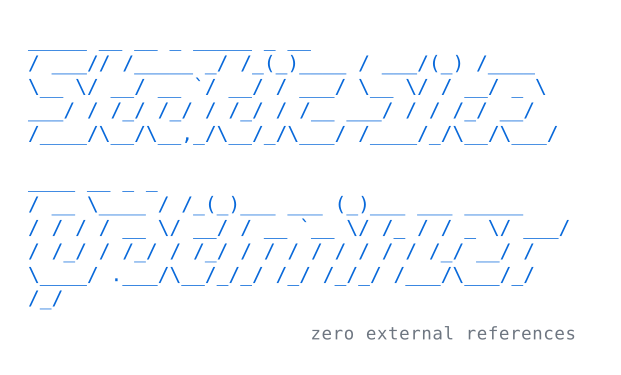
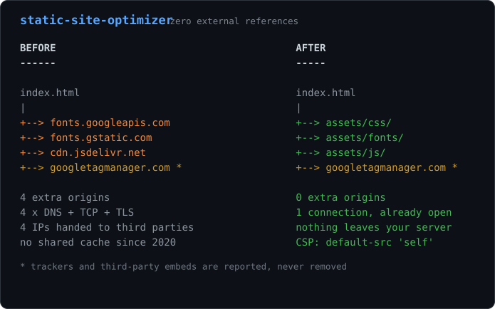

<p align="center">
  
</p>

# Static Site Optimizer

A Claude Code skill that optimizes static sites — plain HTML/CSS/JS served as-is,
no build system — with one central goal: **zero external references**.

Fonts, scripts, stylesheets and images loaded from a CDN are downloaded into the
site and every reference rewritten to the local copy. On top of that, a fixed
list of mechanical hygiene fixes: meta tags, image dimensions, lazy loading,
`robots.txt`, `sitemap.xml`, favicon, `README.md`, `llms.txt`.

Everything else is **report-only**: trackers, third-party embeds, alt-text
quality, meta descriptions, contrast, heading hierarchy. Those need a person, not
an automatic fix.

## Why bother

Every `<link>` or `<script>` pointing somewhere else is a decision with legal,
operational and security consequences:

- **Privacy and GDPR.** An external request hands the visitor's IP address — personal
  data — to a third party, along with a `Referer` naming the exact page being read.
  In 2022 a German court ordered a site operator to pay damages for exactly this,
  over embedded Google Fonts. Self-hosting removes the transfer, and with it the
  consent banner, the DPA and the privacy-policy entry.
- **One source of truth.** What is in the repo is what gets served. No CDN quietly
  changing the bytes, no endpoint retired in 2031 taking your typography with it.
  `git clone` gives you a complete, working, archivable site.
- **One DNS resolution.** Each extra origin costs DNS + TCP + TLS before the first
  byte — 100–300 ms on mobile, on the critical path. HTTP/2 and HTTP/3 multiplex
  per origin, so local assets ride the connection that is already open. And the old
  "everyone has it cached already" argument died in 2020, when browsers partitioned
  the HTTP cache by site.
- **Supply chain.** A third-party script has the same power over your page as your
  own code. When `polyfill.io` changed hands in 2024 it served malware to 100,000+
  sites, none of which had been compromised themselves. With nothing external,
  `Content-Security-Policy: default-src 'self'` becomes a one-line header.
- **Visitors who cannot reach the third party.** Ad blockers, corporate whitelists,
  and Google's domains being unreachable from mainland China all turn an external
  dependency into a broken page — for users who are invisible in your analytics,
  because the same conditions block analytics too.

What that adds up to, on one page:

<p align="center">
  
</p>

The full argument, with the counter-arguments, is in
[`reference/why-self-hosting.md`](.claude/skills/static-site-optimizer/reference/why-self-hosting.md).

## What gets checked

Every HTML page of the site and every local stylesheet — not just `index.html`.

### External references

| Check | Fixed |
|---|---|
| `<link rel=stylesheet>`, `<script src>`, ``/`srcset`, `<source>`, `<video poster>`, `<audio src>`, `<track>`, `<link rel=preload/icon/manifest/modulepreload>` on another origin | **yes** — downloaded to `assets/`, reference rewritten |
| `@import` and `url()` in local stylesheets | **yes** |
| Assets *inside* a downloaded stylesheet (webfonts, background images) | **yes** — followed one level down, resolved against the remote origin |
| `@font-face` without `font-display` in a downloaded stylesheet | **yes** — `swap` added |
| `integrity` / `crossorigin` on a tag that is now local | **yes** — removed |
| A download that fails | no — original URL left intact, finding stays open |
| Trackers and analytics (GA, GTM, Meta Pixel, Hotjar, Clarity, Matomo, Segment, Mixpanel, FullStory, Intercom, HubSpot) | **never** — reported with host and page |
| Third-party embeds (Maps, YouTube, Vimeo, Spotify) | **never** — reported, with a click-to-load facade suggested |
| `preconnect` / `dns-prefetch` orphaned after self-hosting | no — reported |

Out of scope on principle: `<a href>`, `<form action>`, `<iframe src>`. Those are
destinations, not subresources — changing them changes what the page does.

### Document

| Check | Fixed |
|---|---|
| Missing `<meta charset>` | **yes** — UTF-8 |
| Missing `<meta name=viewport>` | **yes** |
| Missing `lang` on `<html>` | only when known — see [About `--lang`](#about---lang) |
| Missing `<meta name=description>` | no — the text depends on the content |

### Images

| Check | Fixed |
|---|---|
| `` without `width`/`height` | **yes** — read from the real file header (PNG/JPEG/GIF) |
| `` past the first two of a page, without `loading` | **yes** — `loading="lazy"` |
| JPEG/PNG over 150KB | with `--compress-images`, and only if at least 10% smaller; same format, same dimensions |

### Links

| Check | Fixed |
|---|---|
| `<a target="_blank">` without `rel="noopener noreferrer"` | **yes** — merged into any existing `rel` |
| A plain-text email, or an `href` that is an address without `mailto:` | **yes** |
| A plain-text phone number, or a numeric `href` without `tel:` | **yes** |
| `++39` in an existing link's text | **yes** — normalised to `+39` |
| Link to `.doc` / `.docx` / `.ppt` / `.pptx` | no — suggests converting to PDF |

### Site files

`robots.txt`, `sitemap.xml`, `README.md`, `llms.txt` and `favicon.ico` are
scaffolded when **completely absent**. The sitemap and `llms.txt` list every HTML
page found, not just the homepage. The favicon is a placeholder — a letter on a
coloured tile — and must be replaced with real artwork.

Every finding code, with its exact trigger, is in
[`reference/checks.md`](.claude/skills/static-site-optimizer/reference/checks.md).

## Layout

The skill lives in `.claude/skills/`, so it is already active as a project skill
when you work inside this repo — nothing to install to develop or try it.

```
.claude/skills/static-site-optimizer/
  SKILL.md                     the procedure the agent follows
  reference/
    why-self-hosting.md        the rationale: privacy, GDPR, DNS, supply chain
    checks.md                  every finding code and whether it is auto-fixed
    self-hosting.md            asset store, naming, path rewriting
  scripts/
    optimize.js                CLI entry point
    lib/
      audit.js                 orchestration
      external/                refs.js, self-host.js, findings.js
      html/                    tags.js, document.js, images.js, links.js
      assets/                  compress.js, dimensions.js, favicon.js
      scaffold/                seo.js, readme.js, llms.js
      site/                    discover.js, files.js, language.js
docs/
  logo.svg                     ASCII wordmark (figlet slant), theme-aware
  before-after.svg             the one-page argument for self-hosting
README.md
package.json
```

Tests sit next to the code they cover (`refs.js` / `refs.test.js`), so moving or
renaming a module carries its test along and gaps are visible at a glance.

## Using the CLI

The script also runs standalone, without Claude. Node only, no npm dependencies.

```bash
# list the static sites under a folder (a site = has index.html in its root)
npm run discover -- ./sites

# report: writes nothing, fetches nothing
npm run optimize -- ./sites/example

# apply the fixes: download external assets and rewrite the references
npm run optimize -- ./sites/example --fix

# same, also re-encoding images over 150KB via npx sharp-cli
npm run optimize -- ./sites/example --fix --compress-images

# ask the site what language it is in, and stop
npm run optimize -- ./sites/example --detect-lang
```

Or by path:

```bash
node .claude/skills/static-site-optimizer/scripts/optimize.js <site> --fix
```

### About `--lang`

The `lang` attribute is the one fix whose value cannot be read off the file being
fixed, so it is resolved in three rungs:

1. `--lang <code>`, if you pass it — always wins.
2. A language the site **declares about itself** on any page (`<html lang>`,
   `og:locale`, `content-language`, a single `hreflang`). Applied automatically:
   that is evidence from the site, not a guess.
3. A **stopword analysis of the page text**. Surfaced as a suggestion in the run's
   `language` block and applied to nothing.

`--detect-lang` runs just the detection and prints `{ lang, source, confidence,
evidence }`. The skill uses it to ask you, offering what it found as the default,
before it changes anything. A wrong `lang` makes a screen reader mispronounce
every word — worse than no attribute — so a guess is never written.

### Output

JSON — a `summary` block, the resolved `language`, and every finding with `code`,
`category`, `autoFixed`, `message` and the `page` it came from.

```json
{
  "mode": "fix",
  "language": { "lang": "it", "source": "html-lang", "applied": true },
  "summary": { "total": 18, "autoFixed": 14, "open": 4,
               "externalRefsRemaining": 0, "selfHostedFiles": 3 }
}
```

## Development

```bash
npm test        # full suite (node:test, no dependencies)
```

## Notes

- `sitemap.xml` uses relative paths: the script never invents a domain.
- No git command is ever run. Changes are left in the working tree for review.
- The SVGs in `docs/` have no external references either — no webfont, no CDN,
  system monospace stack only. They would be a poor advertisement otherwise.
